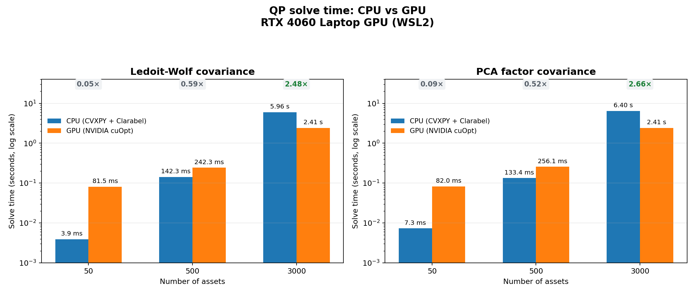
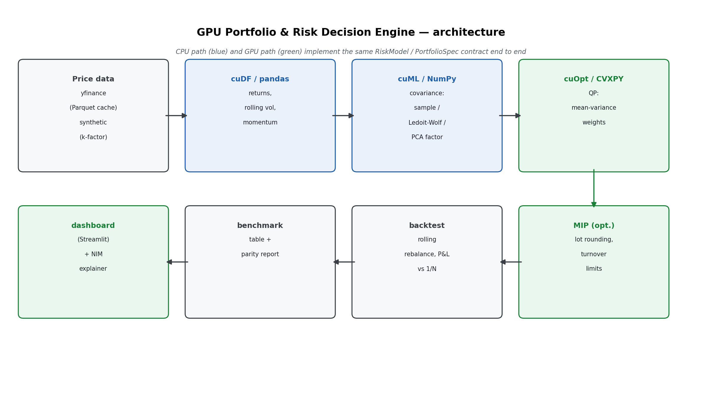

# GPU Portfolio & Risk Decision Engine

Mean-variance portfolio optimization built twice — once on CPU (pandas + CVXPY)
and once on GPU (RAPIDS cuDF/cuML + NVIDIA cuOpt) — with a benchmark harness
that measures where the GPU actually wins, and a validation suite that proves
both paths produce the same answer first.

The CPU path is not a strawman. It is the correctness oracle for the GPU path
and the baseline for every timing claim, and it is written with the same care
(vectorized estimators, no accidental O(T·n²) loops) so that any speedup
measured is attributable to hardware rather than to a deliberately slow
reference.

---

## Status

| Component                                                                     | State                                                                                                    |
| ----------------------------------------------------------------------------- | -------------------------------------------------------------------------------------------------------- |
| Data pipeline (yfinance + synthetic generator, Parquet cache, quality checks) | Complete, tested                                                                                         |
| CPU baseline (returns, rolling features, 3 covariance estimators)             | Complete, tested                                                                                         |
| CPU optimizer (CVXPY + Clarabel QP: box, budget, turnover, group caps)        | Complete, tested                                                                                         |
| Backtest engine (rolling rebalance, costs, no-lookahead, invested-window scoring) | Complete, tested                                                                                     |
| Benchmark harness (per-stage, warm-up separated, variance reported)           | Complete                                                                                                 |
| GPU pipeline (cuDF/CuPy for returns, rolling features, Ledoit-Wolf covariance) | Executed on an RTX 4060 Laptop GPU (WSL2); parity and benchmark results committed                       |
| cuOpt QP layer (box, budget, turnover, group caps)                           | Executed on an RTX 4060 Laptop GPU (WSL2); parity-checked against CVXPY, results committed               |
| cuOpt MIP layer (lot rounding, [`turnover_mip_cuopt.py`](optimizer/turnover_mip_cuopt.py)) | Executed on an RTX 4060 Laptop GPU (WSL2): cuOpt QP → cuOpt MIP tested against HiGHS, formulation against brute force, sweep committed. Under the default cash-band budget it beats greedy in 18 of 18 cases with at most 0.5% cash — **by under 1% in 13 of them** ([why](#what-is-actually-engineered-here), item 4) |
| cuML PCA factor covariance estimator                                         | Executed on an RTX 4060 Laptop GPU (WSL2); parity-checked against the CPU path, benchmark results committed |
| NIM explainer (stretch)                                                       | Executed against NVIDIA's hosted API (Nemotron 3.5 Lightning): 3 of 5 calls answered, and **2 of the 3 replies did arithmetic they were told not to, and got it wrong** ([results](#nim-explainer)) |

GPU numbers below are from a single RTX 4060 Laptop GPU under WSL2 — see
[docs/setup-wsl2.md](docs/setup-wsl2.md) for the bring-up sequence and
"[Reproducing the GPU results](#reproducing-the-gpu-results)" for the exact
commands. The NIM explainer ran against NVIDIA's hosted API rather than a local
GPU: no LLM NIM is validated on an 8 GB card.

### GPU results

Generated from the committed files in `benchmarks/results/` by
`python -m benchmarks.render_tables` — never typed — and only after the
parity checks pass on the same machine.



GPU overhead (kernel launch, host↔device transfer) dominates at 50 assets, so
the GPU is *slower* there by design of the test, not by accident — see
"[Benchmark methodology](#benchmark-methodology)". It crosses over between 500
and 3,000 assets and wins by 2.48–2.66× at 3,000, depending on the covariance
estimator.

<!-- BEGIN GENERATED: gpu-speedup -->
**NVIDIA GeForce RTX 4060 Laptop GPU, 8188 MiB, 592.82** — `ledoit_wolf` covariance — `benchmarks/results/rtx4060-wsl2/`

| stage | assets | CPU | GPU | speedup |
|---|---|---|---|---|
| h2d_transfer | 50 | — | 47.9 ms | — |
| h2d_transfer | 500 | — | 543.1 ms | — |
| h2d_transfer | 3000 | — | 3.72 s | — |
| features | 50 | 10.8 ms | 378.3 ms | 0.03× |
| features | 500 | 93.2 ms | 4.98 s | 0.02× |
| features | 3000 | 630.6 ms | 30.54 s | 0.02× |
| risk_model | 50 | 1.7 ms | 157.8 ms | 0.01× |
| risk_model | 500 | 20.4 ms | 2.14 s | 0.01× |
| risk_model | 3000 | 310.8 ms | 12.01 s | 0.03× |
| psd_repair | 50 | 0.0 ms | 0.0 ms | 0.87× |
| psd_repair | 500 | 0.6 ms | 0.3 ms | 1.90× |
| psd_repair | 3000 | 57.7 ms | 59.4 ms | 0.97× |
| solve | 50 | 3.9 ms | 81.5 ms | 0.05× |
| solve | 500 | 142.3 ms | 242.3 ms | 0.59× |
| solve | 3000 | 5.96 s | 2.41 s | 2.48× |
| solve_cvxpy | 50 | 3.9 ms | 61.1 ms | 0.06× |
| solve_cvxpy | 500 | 142.3 ms | 288.2 ms | 0.49× |
| solve_cvxpy | 3000 | 5.96 s | 4.77 s | 1.25× |

**NVIDIA GeForce RTX 4060 Laptop GPU, 8188 MiB, 592.82** — `pca_factor` covariance — `benchmarks/results/rtx4060-wsl2-pca/`

| stage | assets | CPU | GPU | speedup |
|---|---|---|---|---|
| h2d_transfer | 50 | — | 50.3 ms | — |
| h2d_transfer | 500 | — | 551.1 ms | — |
| h2d_transfer | 3000 | — | 3.68 s | — |
| features | 50 | 11.8 ms | 350.5 ms | 0.03× |
| features | 500 | 91.7 ms | 4.76 s | 0.02× |
| features | 3000 | 626.4 ms | 32.06 s | 0.02× |
| risk_model | 50 | 9.6 ms | 159.8 ms | 0.06× |
| risk_model | 500 | 157.9 ms | 1.96 s | 0.08× |
| risk_model | 3000 | 4.59 s | 12.39 s | 0.37× |
| psd_repair | 50 | 0.0 ms | 0.0 ms | 3.09× |
| psd_repair | 500 | 0.5 ms | 0.3 ms | 1.81× |
| psd_repair | 3000 | 58.6 ms | 58.4 ms | 1.00× |
| solve | 50 | 7.3 ms | 82.0 ms | 0.09× |
| solve | 500 | 133.4 ms | 256.1 ms | 0.52× |
| solve | 3000 | 6.40 s | 2.41 s | 2.66× |
| solve_cvxpy | 50 | 7.3 ms | 62.5 ms | 0.12× |
| solve_cvxpy | 500 | 133.4 ms | 282.0 ms | 0.47× |
| solve_cvxpy | 3000 | 6.40 s | 4.76 s | 1.34× |
<!-- END GENERATED: gpu-speedup -->

### Lot rounding: MIP vs greedy

Stage 2 rounds the stage-1 weights to whole lots. Each row rounds one QP target
four ways and reports L1 tracking error to it, as a share of the book; the MIP
columns add, in parentheses, how that compares with greedy's. The MIP runs
under three budget rules: "fully invested" (realized weights sum to exactly
1), "cash allowed" (greedy's own rule: they sum to at most 1, so greedy's
answer is always feasible for the MIP), and between them the default "cash
band" (invested between 99.5% and 100%).

<!-- BEGIN GENERATED: lot-rounding -->
**NVIDIA GeForce RTX 4060 Laptop GPU, 8188 MiB, 592.82** — $1M book — `benchmarks/results/rtx4060-wsl2-lots/`

| assets | turnover cap | lot | greedy | MIP, fully invested | MIP, cash band | MIP, cash allowed | cash left: greedy / band / cash allowed | MIP solve: fully invested / band / cash allowed |
|---|---|---|---|---|---|---|---|---|
| 50 | none | 1 | 0.55% | 0.55% (0.2% worse) | 0.54% (2.2% better) | 0.54% (2.2% better) | 0.0011% / 0.013% / 0.013% | 2.80 s / 6.80 s / 13.35 s |
| 50 | none | 10 | 6.1% | 6.3% (2.5% worse) | 5.8% (5.7% better) | 5.1% (16% better) | 0.0083% / 0.5% / 2.5% | 2.37 s / 5.43 s / 7.70 s |
| 50 | none | 100 | 40% | 41% (2.7% worse) | 40% (0.89% better) | 38% (5.8% better) | 0.13% / 0.49% / 3.4% | 2.52 s / 2.69 s / 3.38 s |
| 50 | 0.25 | 1 | 0.84% | 0.53% (37% better) | 0.52% (37% better) | 0.52% (37% better) | 0% / 0.002% / 0.002% | 1.25 s / 8.84 s / 12.20 s |
| 50 | 0.25 | 10 | 7% | 7% (0.061% worse) | 6.9% (1.4% better) | 6.3% (10% better) | 0.0041% / 0.46% / 4.4% | 3.29 s / 8.15 s / 7.27 s |
| 50 | 0.25 | 100 | 55% | 56% (1.1% worse) | 55% (0.78% better) | 50% (9.7% better) | 0.034% / 0.34% / 32% | 2.01 s / 2.56 s / 9.42 s |
| 200 | none | 1 | 0.94% | 0.95% (1.6% worse) | 0.93% (0.47% better) | 0.93% (0.47% better) | 0% / 0.0048% / 0.0048% | 7.50 s / 1.79 s / 7.41 s |
| 200 | none | 10 | 11% | 11% (0.36% better) | 11% (1.7% better) | 11% (2.5% better) | 0% / 0.43% / 4.5% | 26.10 s / 448.0 ms / 7.51 s |
| 200 | none | 100 | 83% | 84% (1.7% worse) | 82% (0.51% better) | 79% (4.9% better) | 0.076% / 0.49% / 34% | 11.82 s / 1.90 s / 3.06 s |
| 200 | 0.25 | 1 | 1.3% | 1.3% (0.81% worse) † | 1.3% (0.054% better) † | 1.3% (0.038% better) † | 0% / 0% / 0.0082% | 60.11 s / 60.02 s / 60.03 s |
| 200 | 0.25 | 10 | 14% | 14% (0.14% worse) † | 14% (0.22% better) † | 14% (0.83% better) | 0.0044% / 0.32% / 4.4% | 60.01 s / 60.03 s / 4.77 s |
| 200 | 0.25 | 100 | 104% | 104% (0.0079% worse) | 103% (0.26% better) | 88% (15% better) | 0.0082% / 0.28% / 70% | 34.38 s / 2.42 s / 5.23 s |
| 500 | none | 1 | 4.7% | 4.7% (0.26% worse) † | 4.7% (0.25% better) † | 4.7% (0.25% better) | 0% / 0.04% / 0.04% | 60.04 s / 60.14 s / 4.96 s |
| 500 | none | 10 | 52% | 52% (0.52% better) | 51% (0.9% better) | 50% (3.7% better) | 0.007% / 0.43% / 18% | 56.72 s / 1.35 s / 3.73 s |
| 500 | none | 100 | 172% | 172% (0.23% worse) † | 171% (0.56% better) † | 100% (42% better) | 0.055% / 0.5% / 100% | 60.16 s / 60.08 s / 516.4 ms |
| 500 | 0.25 | 1 | 7.1% | 7.2% (0.41% worse) † | 7.1% (0.08% better) † | 7.1% (0.019% worse) † | 0% / 0.0084% / 0.029% | 60.02 s / 60.04 s / 60.03 s |
| 500 | 0.25 | 10 | 75% | 75% (0.12% worse) † | 75% (0.24% better) † | 68% (8.9% better) | 0.011% / 0.5% / 39% | 60.04 s / 60.04 s / 5.35 s |
| 500 | 0.25 | 100 | 171% | 171% (0.061% worse) † | 170% (0.23% better) † | 100% (41% better) | 0.11% / 0.5% / 100% | 60.02 s / 60.08 s / 675.7 ms |

† hit the time limit: the best solution found is shown, not a proven optimum.
<!-- END GENERATED: lot-rounding -->

### NIM explainer

The explainer turns the optimizer's facts about a rebalance into a few plain
sentences; the model is never asked to compute anything. Each run below asks a
NIM-served model to explain one real rebalance several times, and counts the
replies containing a number that no fact supports, even after rounding.

<!-- BEGIN GENERATED: nim-explainer -->
**nvidia/nemotron-3.5-lightning-30b-a3b** — NVIDIA hosted API — `benchmarks/results/nim-hosted/`

| calls answered | median latency | median tokens/s | replies with numbers the facts don't support |
|---|---|---|---|
| 3 of 5 | 33.96 s | 4 | 2 of 3 (81.9) |

> The rebalance on 2018-10-31 used the full 25% turnover budget, which drove the portfolio's expected annual return to 56.72% and volatility to 30.22%. Position caps of 15% were binding on five names, while a long-only floor excluded 30 names from the universe of 40. Risk is concentrated in SYN00000, which alone contributes 24.0% of the portfolio's variance, with the top five names accounting for the majority of variance.
<!-- END GENERATED: nim-explainer -->

The flagged number is the check doing its job. Two of the three answered replies
said the top five names carry "81.9% of total variance". The facts list their
five shares separately, and they sum to 82.3%. So the model did the arithmetic
it was told not to, and got it wrong, the same way both times. The check cannot
see everything:

- The reply quoted above has no flagged number, but it states a cause the facts
  do not give ("drove the portfolio's expected annual return"). It also says
  "majority of variance", which it could only know by summing.
- Another reply said the rebalance "reduced portfolio turnover to exactly
  25.00%". Turnover is what the rebalance traded, not a level it changed.

The template fallback (`explain_offline`) states the same facts with no such
errors, instantly and at no cost, which is the bar the model has to clear.

Of the two failed calls, one hit the client's 60 s timeout. The other stopped at
the 400-token limit, even with thinking off and answers running about 120
tokens. Latency is that of NVIDIA's free hosted tier from a laptop. Queueing
dominates, so the 4 tokens/s says nothing about the model's throughput on
dedicated hardware.

---

## Quick start (CPU, no GPU required)

```bash
make venv
make test
```

```bash
make backtest
```

```bash
make bench
```

The full CPU pipeline — data, risk models, optimizer, backtest, benchmark
harness, dashboard — runs on any machine. Only the GPU column needs CUDA.

---

## Architecture



```
 Price data           cuDF / pandas         cuML / NumPy          cuOpt / CVXPY
┌──────────────┐     ┌───────────────┐    ┌────────────────┐    ┌───────────────┐
│ yfinance     │────▶│ returns,      │───▶│ covariance:    │───▶│ QP:           │
│ (Parquet     │     │ rolling vol,  │    │ sample /       │    │ mean-variance │
│  cache)      │     │ momentum      │    │ Ledoit-Wolf /  │    │ weights       │
│ synthetic    │     │               │    │ PCA factor     │    │               │
│ (k-factor)   │     └───────────────┘    └────────────────┘    └───────┬───────┘
└──────────────┘                                                        │
                                                                        ▼
┌──────────────┐     ┌───────────────┐    ┌────────────────┐    ┌───────────────┐
│ dashboard    │◀────│ benchmark     │◀───│ backtest:      │◀───│ MIP (opt.):   │
│ (Streamlit)  │     │ table +       │    │ rolling        │    │ lot rounding, │
│ + NIM        │     │ parity report │    │ rebalance, P&L │    │ turnover      │
│  explainer   │     │               │    │ vs 1/N         │    │ limits        │
└──────────────┘     └───────────────┘    └────────────────┘    └───────────────┘
```

Both backends implement the same two interfaces — `RiskModel` in
[`pipeline/risk_model.py`](pipeline/risk_model.py) and `PortfolioSpec` /
`Solution` in [`optimizer/spec.py`](optimizer/spec.py). The backtest and the
benchmark take the risk-model function and solver function as arguments, so
switching CPU→GPU changes two callables and nothing else. That is what makes
"same problem, different hardware" a structural guarantee rather than a claim.

---

## What is actually engineered here

Five decisions carry most of the technical weight:

**1. Ledoit-Wolf shrinkage, in closed form, on both sides.**
At realistic universe sizes the number of assets is comparable to the number of
trading days in the estimation window, so the sample covariance matrix is
ill-conditioned or singular — and mean-variance optimization is maximally
sensitive to exactly those small eigenvalues. The textbook formulation of the
shrinkage intensity loops over T observations forming n×n outer products: about
2.3 × 10¹⁰ operations at n = 3,000 over ten years. The identity

```
Σ_t ‖x_t x_tᵀ − S‖²_F  =  Σ_t (x_tᵀ x_t)²  −  T‖S‖²_F
```

collapses that to a single reduction over rows. Both
[`pipeline/cpu_baseline.py`](pipeline/cpu_baseline.py) and
[`pipeline/gpu_pipeline.py`](pipeline/gpu_pipeline.py) use it, and
`test_ledoit_wolf_matches_naive_loop_implementation` pins the vectorized version
to the literal loop form. Writing the CPU baseline the naive way would have
manufactured a large fake speedup.

**2. The quadratic-objective convention is probed, not assumed.**
Solvers disagree on whether a quadratic matrix means `xᵀQx` or `½xᵀQx`. Getting
it wrong silently halves or doubles the effective risk aversion — the resulting
portfolio still looks entirely plausible, so the bug survives inspection.
[`optimizer/cuopt_compat.py`](optimizer/cuopt_compat.py) determines the
convention at runtime by solving a one-variable problem whose answer is 0.5
under one convention and 1.0 under the other.

**3. The objective is built the way cuOpt actually reads it.**
cuOpt's `Problem.setObjective` zeroes every linear objective coefficient before
applying the expression it is given, so a return term passed as
`addVariable(obj=...)` is silently dropped and the solve becomes minimum-variance.
This project shipped exactly that bug until reading the solver source turned it
up ([details](docs/case-study.md#reading-the-solver-source-not-just-its-reference)).
The return term now travels inside the objective expression. The covariance goes
in as one sparse matrix, zero-padded over any auxiliary variables because cuOpt
adds a matrix-form quadratic positionally. Each linear term is a single
`LinearExpression` rather than an `expr = expr + term` chain that allocates n
intermediate objects. `tests/test_cuopt_formulation.py` checks the assembled
model against a stand-in with cuOpt's model-building semantics, so the
formulation is tested on machines without a GPU. Model build time is still
reported separately from solve time in every benchmark, because the dense n²
covariance hand-off is a real cost and hiding it inside "GPU time" would cut
both ways.

**4. Two-stage QP → MIP, because cuOpt's MIP solver is linear-objective and beta.**
Forcing integrality and the quadratic risk term into one MIQP fights the tool.
Stage 1 solves the continuous QP for ideal weights; stage 2
([`optimizer/turnover_mip_cuopt.py`](optimizer/turnover_mip_cuopt.py)) solves a
linear MIP that rounds them to tradeable lots, minimizing L1 tracking error plus
explicit transaction cost. The cost of the split is that rounding is not
risk-aware — so `report_drift` measures the realized volatility gap per
rebalance, and a greedy largest-remainder rounder is included as the baseline
the MIP has to beat. If it does not beat it, that gets reported.

It does now, narrowly, but only once the budget rule was fixed
([table](#lot-rounding-mip-vs-greedy)). Neither of the first two rules works:

- **Fully invested** (`max_cash=0`). This lost to greedy in 17 of the 18 sweep
  cases in the first GPU run, and in 15 of 18 on a rerun. Greedy may keep cash
  and this rule may not, so the two were never solving the same problem. Worse,
  integer lots at market prices can meet `sum(w) = 1` only to within a solver's
  feasibility tolerance, and that tolerance decides the answer. On a 50-name
  book, widening the allowed budget miss from 1e-8 to 1e-7 (one cent to ten
  cents on $1M) moved HiGHS's proven optimum by 5%. cuOpt's and HiGHS's
  "optimal" fully-invested answers differ by as much as 6.4%, in both
  directions, and cuOpt's own answers change between runs.
- **Cash allowed** (`max_cash=1`, greedy's own rule). Greedy's answer is
  always feasible here. At 10- and 100-share lots, though, the MIP wins largely
  by leaving cash uninvested, up to the whole book.

The default is a **cash band** (`max_cash=0.005`): invested between 99.5% and
100%. Unlike the exact budget, it is well-posed, since widening its floor by
1e-6 moves the optimum by at most 2e-5. It also admits greedy's answer
whenever greedy leaves 0.5% cash or less, which it did in every sweep case.
On the RTX 4060 it:

- beat greedy in all 18 cases, with at most 0.50% cash;
- won by under 1% in 13 of them, and by 1.4% to 5.7% in four more;
- won the one large case, 37% at 50 names with a turnover cap, which every MIP
  rule wins.

cuOpt reached the same answer as HiGHS in all 18 cases (within 0.007%), or a
better one. At 200 names with a turnover cap and single-share lots, its 60 s
incumbent was 1.5% better than HiGHS's after 120 s. It is not faster at this
size, though. It hit its 60 s limit without proving optimality in 7 cases, and
HiGHS on a laptop CPU proved 5 of those 7 in under 7 s. A few hundred integer
lot variables is not yet a problem size where a GPU MIP pays off. Two more
properties of the stage-2 objective, measured rather
than assumed: moving a share toward its target cuts L1 tracking error by its
price over the book value, more than any realistic per-share fee, so the cost
term barely moves the answer (in the test universe it took $20 a share) and
only `max_trades` really limits turnover; and stage 2 does not enforce stage
1's turnover cap, which rounding can overshoot by up to the rounding error.

**5. No-lookahead is enforced structurally and tested adversarially.**
A lookahead bug does not crash; it just produces a beautiful equity curve. The
backtest slices `prices.loc[:date]` before the risk model sees anything, and
[`tests/test_backtest.py`](tests/test_backtest.py) both records the last date
every risk model was handed (asserting it never exceeds its own rebalance date)
_and_ runs a deliberately cheating variant to confirm that foresight would in
fact show up — so the test cannot pass by being vacuous. The same structural
approach covers scoring: every result is scored from its first rebalance,
the equal-weight benchmark runs through the same engine on the same schedule,
and `compare_results` refuses results scored over different dates — the fix
for an evaluation bug an earlier version of this project had
([erratum](docs/case-study.md#erratum-2026-09-12)).

---

## Benchmark methodology

`benchmarks/harness.py` encodes four rules, each corresponding to a common way
GPU benchmarks are unintentionally inflated:

- **Warm-up is reported, not dropped.** The first call pays CUDA context
  creation, kernel JIT and memory-pool growth. It is a separate `warmup_s`
  column, never averaged in and never quietly discarded.
- **Device synchronization before the clock stops.** CUDA is asynchronous;
  timing without a sync measures how fast Python enqueues kernels.
- **Variance is reported.** Five runs, with median, std and coefficient of
  variation. GPU timings are frequently bimodal and a bare mean hides that.
- **Stages are timed separately** — host→device transfer, feature engineering,
  covariance, solve — so a fast stage cannot carry a slow one, and the
  crossover point can be located per stage rather than in aggregate.

Universe sizes 50 / 500 / 3,000 over ~10 years of daily data. At n = 50 the GPU
is expected to _lose_ to the CPU: kernel launch and transfer overhead dominate a
problem that small. That crossover is a finding, not an embarrassment, and it
gets reported.

**Fairness constraints:** same physical machine for both columns, identical
random seeds, identical algorithms on both sides (not sklearn-vs-cuML), and
float64 on both sides. Float32 would give cuDF a ~2× bandwidth advantage but
loses roughly seven significant digits in the covariance — enough to change the
optimizer's answer. `dtype` is exposed so that tradeoff can be measured
separately rather than silently taken.

---

## Validation

Correctness is established before any timing is trusted:

```bash
make test      # GPU tests skip cleanly off-GPU
make parity    # CPU vs GPU numerical comparison
```

The checks that matter most have **no solver on the reference side**, so a bug
shared by CVXPY and cuOpt could not hide behind their agreement:

- Two uncorrelated assets: minimum-variance weights must equal `(1/σ²) / Σ(1/σ²)`.
- General minimum variance: must equal `Σ⁻¹1 / 1ᵀΣ⁻¹1`.
- The solver's objective must not be beaten by the analytic solution.
- Monotonicity along the efficient frontier (a sign-error canary).

For CPU-vs-GPU solution comparison, the **objective value** is held to 1e-6
(cuOpt's barrier solver converges to 1e-8 *relative* accuracy, so the absolute
gap grows with the objective) and per-name **weights** only to 1e-4 —
deliberately. Mean-variance problems with
many near-substitutable assets have a flat optimum, so two solvers can land on
visibly different weight vectors whose objectives agree to ten digits. Asserting
tight weight equality produces false failures, and a test that cries wolf is a
test that gets ignored.

---

## Reproducing the GPU results

Any CUDA GPU from Volta onward with at least 16 GB of system RAM (cuOpt's
minimum). On Windows with a GeForce RTX card, follow
[`docs/setup-wsl2.md`](docs/setup-wsl2.md), which also covers what WSL2 can and
cannot measure. The GPU stack is pinned to a single release (cuDF, cuML and
cuOpt 26.08) in `requirements-gpu.txt`:

```bash
pip install --extra-index-url=https://pypi.nvidia.com -r requirements-gpu.txt
```

Or in the container (base image pinned by digest):

```bash
docker build -t gpu-portfolio-engine . && docker run --gpus all -it --rm -v $(pwd):/workspace gpu-portfolio-engine
```

Then, **in this order** — parity before speed, always:

```bash
python -m pipeline.parity_tests --n 500 --days 2520
```

```bash
python -m benchmarks.run_benchmarks --sizes 50 500 3000 --days 2520 --runs 5
```

```bash
python -m backtest.run_backtest --source synthetic --n 500 --frequency QE
```

The PCA factor estimator — the one stage that runs cuML rather than cuDF/CuPy —
gets its own parity check and sweep, and stage 2 its MIP-vs-greedy comparison:

```bash
python -m pipeline.parity_tests --n 500 --days 2520 --estimator pca_factor
```

```bash
python -m benchmarks.run_benchmarks --sizes 50 500 3000 --days 2520 --runs 5 --estimator pca_factor --out benchmarks/results/<host>-pca
```

```bash
python -m benchmarks.run_lot_rounding --sizes 50 200 500 --out benchmarks/results/<host>-lots
```

The NIM explainer needs an endpoint rather than a GPU: NVIDIA's hosted API
with a key from [build.nvidia.com](https://build.nvidia.com) in
`NVIDIA_API_KEY` (read from the environment, never written to the results), or
a local NIM container via `--endpoint`:

```bash
python -m explainer.run_explainer --out benchmarks/results/nim-hosted
```

Results land in `benchmarks/results/` as CSVs plus an `environment.json`
recording GPU model, driver, and every library version. Estimated cost for the
full sweep: 10–20 GPU-hours at $0.50–1.50/hr, so roughly **$10–30**.

Version-sensitive name lookups are isolated in `optimizer/cuopt_compat.py`,
which raises a message naming the docs page rather than an `AttributeError`
deep in the optimizer. Behavioral changes are a different matter — the
objective bug above was one — which is why parity runs before any timing.

---

## Known limitations

Stated here rather than discovered by a reader:

- **Survivorship bias.** The yfinance path uses the _current_ S&P 500 membership,
  so the backtest never holds a company that was delisted or acquired. This
  inflates returns. Fixing it properly needs point-in-time constituent data
  (CRSP/Compustat), which is not freely available.
- **Expected returns are historical means.** This is the standard textbook
  choice and also the standard reason mean-variance disappoints out of sample:
  sample means are a famously noisy return forecast. On the real-data snapshot
  the optimizer and a same-schedule equal-weight benchmark are level on Sharpe
  (0.93 vs 0.90, well inside the ~0.4 standard error of a 9-year estimate),
  with the optimizer taking about 8 points more volatility and six times the
  turnover — consistent with DeMiguel, Garlappi & Uppal (2009), and reported
  rather than tuned away.
- **The synthetic generator is a k-factor model with constant per-asset drift**,
  so it is generous to factor-based covariance estimators, and it makes
  historical means informative by construction — mean-variance "wins" there
  for that reason alone. It exists to reach universe sizes free data sources
  will not serve, and every result records which source produced it; synthetic
  and real numbers are never mixed in one table.
- **No transaction-cost model beyond linear bps.** No market impact, no bid-ask
  spread modeling, no borrow costs.
- **Daily data only.** Nothing intraday.

---

## Repository layout

```
data/          universe.py (yfinance + synthetic), validate_data.py, download_universe.py
pipeline/      risk_model.py (shared contract), cpu_baseline.py, gpu_pipeline.py, parity_tests.py
optimizer/     spec.py (shared contract), mean_variance_cpu.py, mean_variance_cuopt.py,
               turnover_mip_cuopt.py, cuopt_compat.py (version shim)
backtest/      engine.py, run_backtest.py
benchmarks/    harness.py, run_benchmarks.py, run_lot_rounding.py, render_tables.py (docs tables from results/), results/
explainer/     nim_explainer.py
dashboard/     app.py
notebooks/     colab_gpu_runner.ipynb (second GPU data point on a free T4)
docs/          case-study.md, setup-wsl2.md (Windows 11 + WSL2 GPU bring-up)
tests/         test_data.py, test_risk_models.py, test_optimizer.py, test_backtest.py,
               test_cuopt_formulation.py + fake_cuopt.py, test_lot_rounding.py, test_benchmarks.py,
               test_render_tables.py
```

---

## References

- NVIDIA cuOpt Python API — `Problem` / `QuadraticExpression` / `SolverSettings`
  signatures verified against the [26.02 LP/QP/MILP API reference](https://archive.docs.nvidia.com/cuopt/user-guide/26.02.00/cuopt-python/lp-qp-milp/lp-qp-milp-api.html)
  and [examples](https://archive.docs.nvidia.com/cuopt/user-guide/26.02.00/cuopt-python/lp-qp-milp/lp-qp-milp-examples.html) (July 2026).
- [NVIDIA cuOpt docs](https://docs.nvidia.com/cuopt/user-guide/latest/) · [github.com/NVIDIA/cuopt](https://github.com/NVIDIA/cuopt)
- [RAPIDS cuDF](https://docs.rapids.ai/api/cudf/stable/) — pandas-compatible GPU dataframes.
- Ledoit, O. & Wolf, M. (2004), "A well-conditioned estimator for large-dimensional
  covariance matrices," _Journal of Multivariate Analysis_ 88(2).
- DeMiguel, V., Garlappi, L. & Uppal, R. (2009), "Optimal Versus Naive
  Diversification," _Review of Financial Studies_ 22(5).
